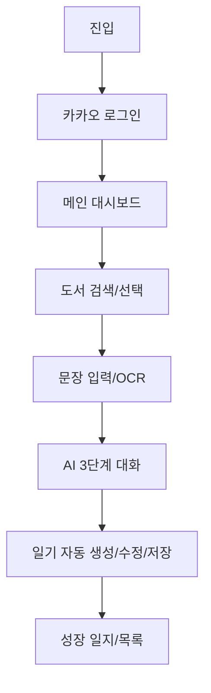
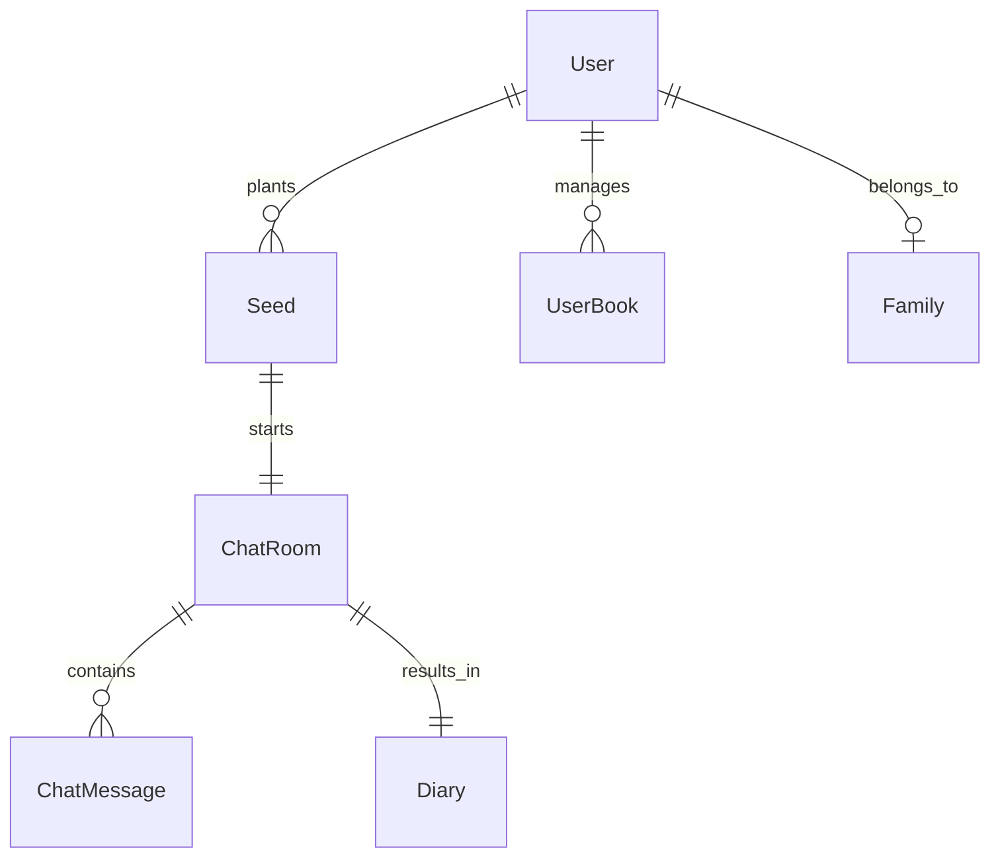

# 🌱 생각의 씨앗 (Seed of Thought) v1.0 마스터 문서

본 문서는 '생각의 씨앗' 서비스의 기획부터 기술 사양까지 모든 핵심 정보를 포함합니다.

---

## 1. PRD (제품 요구사항 정의서)

### 1.1 서비스 개요
- **정의**: 아이가 읽은 책의 한 문장에서 시작하여, AI 상담사와 대화하며 생각을 확장하고 한 편의 일기를 완성하는 AI 기반 독서 기록 서비스.
- **핵심 가치**: 
    - **사고 확장**: 단순 기록을 넘어 AI가 질문을 던져 아이의 상상력을 자극함.
    - **성취감**: 대화만으로 완성도 높은 일기를 생성하여 글쓰기에 대한 부담을 줄임.
    - **성장 기록**: 시각화된 차트를 통해 독서 습관을 시각적으로 확인.

### 1.2 핵심 기능 (MVP v1.0)
- **씨앗 심기**: 도서 검색 및 기억에 남는 문장 입력 (OCR 지원).
- **AI 대화(Sprout)**: 전문 아동 상담사 페르소나의 3단계 가이드 대화.
- **일기 생성**: 대화 요약 및 감정 분석 기반 자동 일기 생성 및 저장.
- **성장 리포트**: 월별 독서 통계 차트 및 도서 상태 관리 (읽는 중/완료).

---

## 2. 사용자 플로우 및 IA (User Flow & Information Architecture)

### 2.1 주요 사용자 플로우

### 2.2 메뉴 구조 (IA)
- **Home**: 씨앗 심기 버튼, 최근 읽고 있는 책 목록, 오늘 추천 메시지.
- **Archive**: 저장된 일기 목록, 감정별/날짜별 필터링.
- **My Reading**: 
    - **읽고 있어요**: 현재 진행 중인 도서 목록.
    - **다 읽었어요**: 완료된 도서 목록 및 월간 독서 차트.

---

## 3. 기술 스택 및 외부 API (Tech Stack & APIs)

### 3.1 기술 스택
- **Frontend**: React Native (Expo SDK 54), Zustand (상태 관리), Styled-components (스타일링).
- **Backend**: NestJS (v11), Prisma (ORM), PostgreSQL.
- **Infra**: Render (Backend), Vercel (Frontend Preview), Neon (Database).

### 3.2 외부 API 및 서비스
- **AI Engine**: 
    - Gemini 2.0 / Groq (대화 및 일기 생성)
    - OpenAI Whisper (STT - 향후 확장 예정)
- **Vision**: Google Cloud Vision API (문장 OCR).
- **Auth**: Kakao SDK (소셜 로그인).

---

## 4. 데이터 모델링 (ERD)

주요 모델 간의 관계:
- **User**: 회원 정보 및 가족(Family) 연동.
- **Seed**: 아이가 선택한 책과 문장 정보.
- **ChatRoom & Message**: AI와 나눈 대화 로그 기록.
- **Diary**: 대화 결과로 생성된 최종 결과물.
- **UserBook**: 사용자의 개인 도서관 상태(상태값: `READING`, `COMPLETED`).

---

## 5. 디자인 시스템 (Design System)

### 5.1 브랜드 컨셉
- **Keyword**: 따뜻함, 성장, 자연, 친근함.
- **Tone & Manner**: 부드러운 파스텔 톤과 둥근 모서리 UI를 통해 심리적 안정감 제공.

### 5.2 컬러 팔레트
- **Seed Green (#4CAF50)**: 성장과 자연을 상징하는 주 컬러.
- **Primary Orange (#FF9800)**: 활기와 창의성을 상징하는 포인트 컬러.
- **Soft Background (#F8F9FA)**: 눈이 편안한 미색 배경.

### 5.3 타이포그래피 (Typography)
- **Title**: Inter / Outfit (Bold, 대화 및 제목용).
- **Body**: Pretendard / Roboto (Medium/Regular, 본문 및 일기용).
